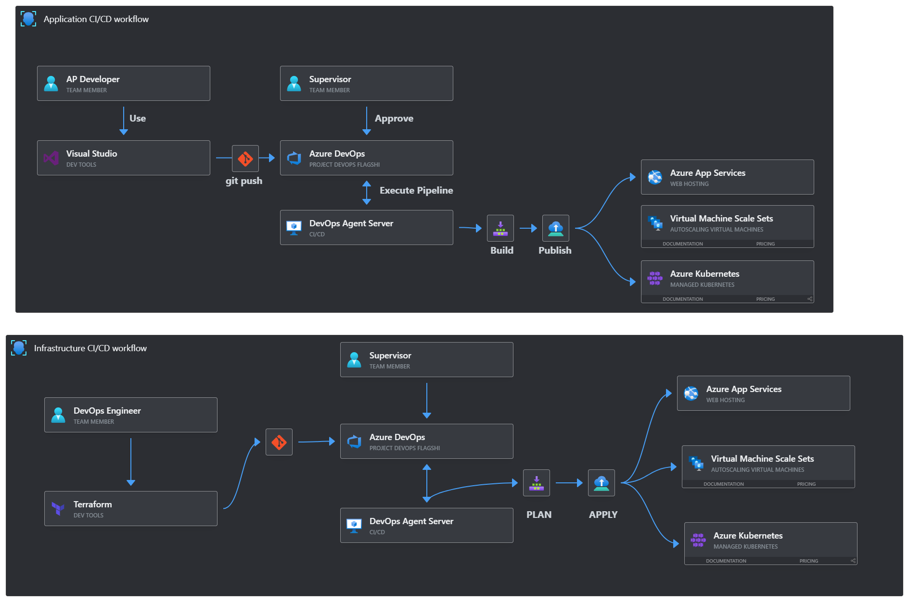

## Table of Contents

- [Project Overview](#project-overview)
- [Goal](#Goal)
- [Architecture Diagram](#High-level-Architecture)
- [CI/CD Workflow](#CICD-Workflow)
- [Project Directory Structure](#Directory-Structure)

## Project Overview
Enterprise level DevOps project with Azure + Terraform 

Puprose of the Repository
Enterprise Infrastrucutre on Azure with Terraform, Azure Kubernetes Service, Azure App Servcice, Azure SQL CI/CD

## Goal 
Deploy a production ready application(frontend + Backend) on Azure using Terraform and Azure DevOps Pipelines with enterprise grade networking, security and Monitoring

Frontend -- Deployed on Azure App Service 
Backend  --  
  Service A (User API)  --> Hosted on Azure VMs  
  Serice  B (Orders API)  --> deployed on Azure AKS  
  Database -- Azure Sql Server

Infrastrucutre Management - Terraform modules + Remote backend  
CI/CD - Azure DevOps Pipelines (Build + Release stages)  
Security - Azure Key Vault, NSG Managed Identity  
Monitoring - Azure Monitor, Log Analytics Workspace

Add Obeservability for centralised logging and Metrics collection. follow the linkedIN article (https://www.linkedin.com/feed/update/urn:li:activity:7395095520207171595?updateEntityUrn=urn%3Ali%3Afs_updateV2%3A%28urn%3Ali%3Aactivity%3A7395095520207171595%2CFEED_DETAIL%2CEMPTY%2CDEFAULT%2Cfalse%29)

## Architecture Diagram


## CI/CD Workflow 



## Project Directory Structure

Azure-Enterprise-Infra/
```│
├── README.md                      # Project documentation
├── architecture/
│   └── enterprise-diagram.png     # Architecture diagram
│
├── terraform/
│   ├── backend/                   # Remote backend config
│   ├── modules/
│   │   ├── network/               # VNet, subnets, NSG, route tables
│   │   ├── compute/               # VMs for User API
│   │   ├── aks/                   # AKS cluster setup
│   │   ├── appservice/            # Frontend App Service
│   │   ├── sql/                   # Azure SQL setup
│   │   ├── keyvault/              # Secrets and credentials
│   │   └── monitor/               # Log analytics and alerts
│   ├── environments/
│   │   ├── dev/
│   │   └── staging/
│   └── main.tf
│
├── src/
│   ├── frontend/                  # React frontend
│   ├── user-api/                  # Node/Flask app hosted on VM
│   └── orders-api/                # Containerized app for AKS
│
├── pipelines/
│   ├── build-pipeline.yaml        # Build and image creation
│   └── release-pipeline.yaml      # Infra + App deployment
│
└── docs/
    ├── setup_guide.md
    ├── terraform_walkthrough.md
    └── ci_cd_pipeline_steps.md```

